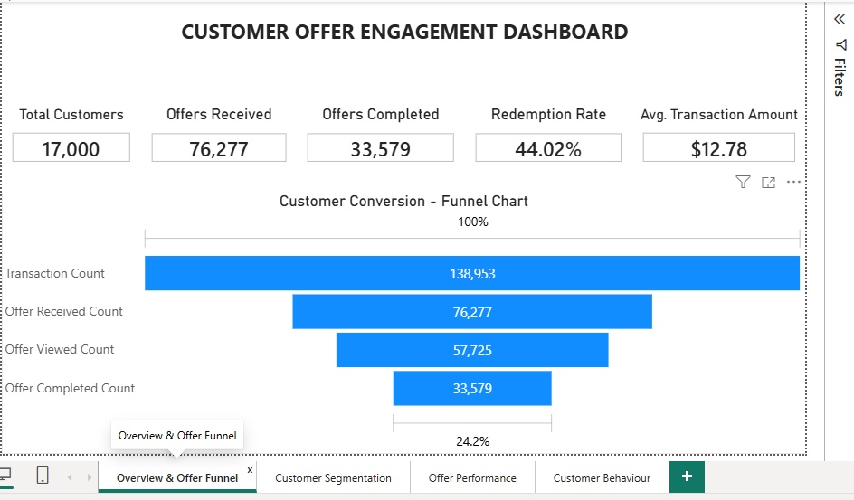
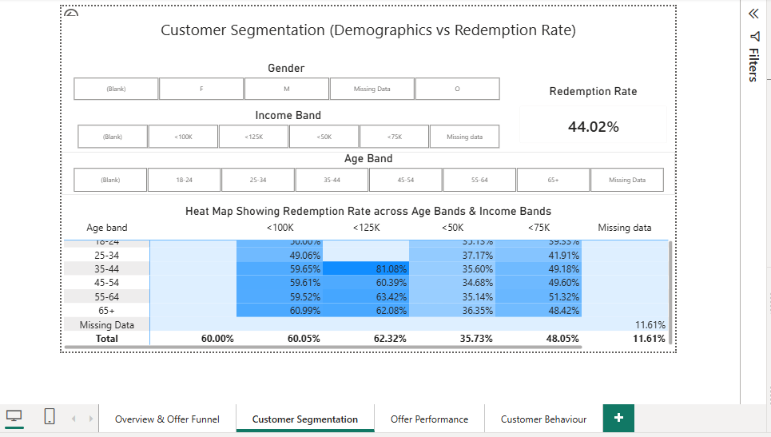
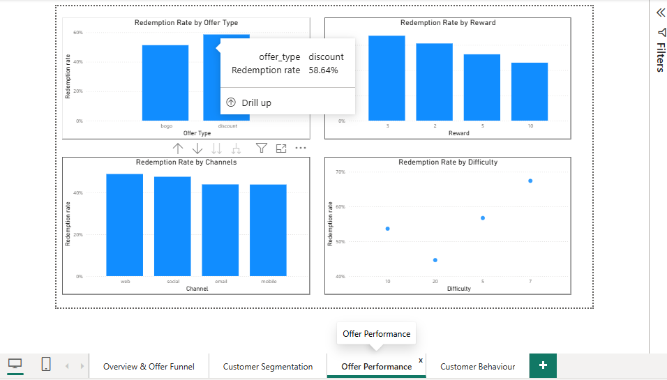

# 📊 Customer Offer Engagement Dashboard

## Project Overview

The Customer Offer Engagement Dashboard is an interactive Power BI solution designed to analyze customer engagement, offer performance, and redemption behavior.

The dashboard provides actionable business insights through interactive KPIs, customer segmentation, and offer analytics.

---

## Project Objectives

- Analyze customer engagement
- Measure offer redemption performance
- Identify customer segments
- Compare marketing channels
- Track offer completion rates
- Improve business decision-making

---

## Dashboard Features

### Executive Overview

- Total Customers
- Offers Sent
- Offers Redeemed
- Redemption Rate
- Average Reward

### Customer Segmentation

- Gender Analysis
- Age Group Analysis
- Income Segmentation
- Redemption Trends

### Offer Performance

- Offer Type Comparison
- Reward Analysis
- Completion Rate
- Channel Performance

### Event Timeline

- Monthly Activity
- Customer Journey
- Event Trends

---

## Tools & Technologies

- Power BI Desktop
- Power Query
- DAX
- Microsoft Excel / CSV
- JSON Parsing

---

## Data Model

The dashboard follows a **Star Schema**.

Fact Table

- Events

Dimension Tables

- Customers
- Offers
- Date

---

## Key DAX Measures

- Total Customers
- Total Offers Sent
- Total Offers Redeemed
- Redemption Rate
- Average Reward
- Completion Rate

---

## Power Query Transformations

- Import CSV files
- JSON Extraction
- Data Cleaning
- Remove Duplicates
- Change Data Types
- Merge Queries

---

## Dashboard Preview

### Executive Dashboard



### Customer Segmentation



### Offer Performance



---

## Project Structure

```text
Customer-Offer-Engagement-Dashboard
│
├── Dashboard.pbix
├── Dataset
├── Documentation
├── Screenshots
└── README.md
```

---

## Future Enhancements

- Power BI Service Deployment
- Scheduled Refresh
- Row-Level Security (RLS)
- Azure SQL Integration
- Real-time Dashboard
